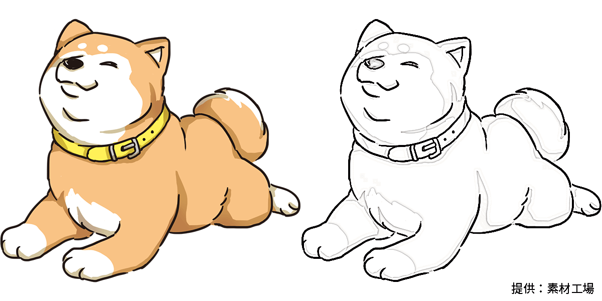

# sengaka

線画化 - CLI tool to make images a line drawing, being suitable to anime captures or illustrations



```
sengaka 0.2.0
CLI tool to make images a line drawing

USAGE:
    sengaka [FLAGS] [OPTIONS] --if <FORMAT> --of <FORMAT>

FLAGS:
    -h, --help       Prints help information
    -q, --quite      Disables printing logs
    -V, --version    Prints version information

OPTIONS:
    -i, --input <FILE>       Input file or directory path. If omit, stdin is used.
    -I, --if <FORMAT>        Input image format. Required if input is stdin. e.g. png, jpg, ...
    -o, --output <FILE>      Output file or directory path. If omit, stdout is used.
    -O, --of <FORMAT>        Output image format. Required if output is stdout. e.g. png, jpg, ...
    -S, --shadow <shadow>    Shadow input level (0 ~ 255) [default: 150]
    -s, --sigma <sigma>      Blur sigma [default: 1.8]
```

## Install

**Windows**: ~~Download from [releases](https://github.com/rot1024/sengaka/releases).~~ Not ready yet

**MacOS or Linux**:

```sh
curl -L https://github.com/rot1024/sengaka/releases/download/v0.1.0/sengaka_0.1.0_`uname -s`_`uname -m` > /usr/local/bin/sengaka && chmod +x /usr/local/bin/sengaka
```

## Usage

```
sengaka -i foo.png -o bar.jpg
sengaka -i foo.png -O jpg > bar.jpg
sengaka -I png -o bar.jpg < foo.png
sengaka -I png -O jpg < foo.png > bar.jpg
```

## Supported image format

Alpha image is not supported.

- JPEG (`jpg` or `jpeg`)
- PNG (`png`)
- GIF (`gif`)
- WebP (`webp`)
- TIFF (`tif` or `tiff`)
- TGA (`tga`)
- BMP (`bmp`)
- ICO (`ico`)
- HDR (`hdr`)
- PNM (`pbm`, `pam`, `ppm`, or `pgm`)
